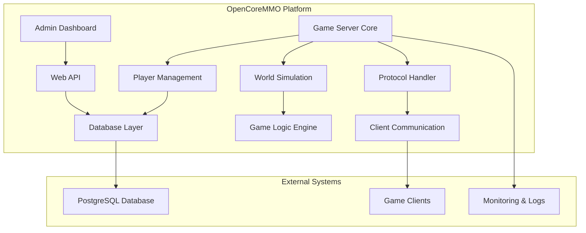

# OpenCoreMMO Documentation

Welcome to the comprehensive documentation for OpenCoreMMO, a modern .NET-based MMORPG server implementation.

## 📖 Documentation Structure

This documentation follows Inner Source principles, providing clear guidance for contributors and maintainers.

### 🎯 Quick Navigation

| Section | Description | Quick Links |
|---------|-------------|-------------|
| **Contributing** | Guidelines for contributors | [Branch Strategy](./contributing/branch-strategy.md) • [Commit Guidelines](./contributing/commit-guidelines.md) |
| **Development** | Development workflows and standards | [Versioning](./development/versioning-strategy.md) • [Release Process](./development/release-process.md) |
| **Implementation** | Current system status | [Implementation Status](./implementation-status.md) |

## 🚀 Getting Started

For new contributors, we recommend starting with:

1. **[Contributing Guidelines](./contributing/README.md)** - Essential information for all contributors
2. **[Branch Strategy](./contributing/branch-strategy.md)** - How we organize our codebase
3. **[Commit Guidelines](./contributing/commit-guidelines.md)** - Writing meaningful commits
4. **[Versioning Strategy](./development/versioning-strategy.md)** - Understanding our release cycle

## 🎪 Project Management

> **📋 Feature Planning & Priorities**  
> Current development priorities and future features are tracked in our [GitHub Projects](https://github.com/opencoremmo/opencoremmo/projects). 
> 
> Please refer to the project boards for:
> - 🎯 Current sprint priorities
> - 🗺️ Roadmap and upcoming features
> - 🐛 Bug tracking and resolution status
> - 💡 Feature requests and discussions

## 🏗️ Architecture Overview

## 🤝 Community & Support

- **Issues**: Report bugs or request features via [GitHub Issues](https://github.com/opencoremmo/opencoremmo/issues)
- **Discussions**: Join community conversations in [GitHub Discussions](https://github.com/opencoremmo/opencoremmo/discussions)
- **Contributing**: See our [Contributing Guide](./contributing/README.md)

## 📚 Additional Resources

- [API Documentation](./api/) *(Coming Soon)*
- [Deployment Guide](./deployment/) *(Coming Soon)*
- [Security Guidelines](./security/) *(Coming Soon)*

---

> 💡 **Note**: This documentation is actively maintained by the OpenCoreMMO community. 
> If you find any inconsistencies or have suggestions for improvements, please [open an issue](https://github.com/opencoremmo/opencoremmo/issues/new) or submit a pull request.
