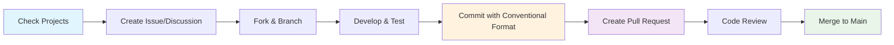
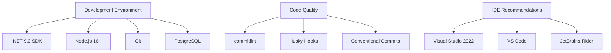

# Contributing Guidelines

Welcome to OpenCoreMMO! We're excited to have you contribute to our modern MMORPG server implementation.

## 🎯 Project Management & Priorities

> **📋 Current Development Status**  
> All current priorities, features in development, and future roadmap items are managed through our [GitHub Projects](https://github.com/opencoremmo/opencoremmo/projects).
>
> **Before starting any work:**
> 1. Check the [active project boards](https://github.com/opencoremmo/opencoremmo/projects) for current priorities
> 2. Review [open issues](https://github.com/opencoremmo/opencoremmo/issues) for bugs and feature requests
> 3. Join relevant [discussions](https://github.com/opencoremmo/opencoremmo/discussions) for feature planning

## 🚀 Quick Start for Contributors

### Prerequisites

- **.NET 9.0 SDK** or later
- **Node.js 16+** (for commit tooling)
- **PostgreSQL** (for database)
- **Git** with proper configuration

### Setting Up Development Environment

1. **Clone the repository**:
   ```bash
   git clone https://github.com/opencoremmo/opencoremmo.git
   cd opencoremmo/server
   ```

2. **Install commit validation tools**:
   ```bash
   npm install
   ```

3. **Create your feature branch**:
   ```bash
   git checkout -b feature/your-feature-name
   ```

## 📋 Contribution Workflow



### Step-by-Step Process

1. **📋 Planning Phase**
   - Review [GitHub Projects](https://github.com/opencoremmo/opencoremmo/projects) for priorities
   - Create or comment on relevant issues
   - Discuss approach in GitHub Discussions if needed

2. **🔧 Development Phase**
   - Follow our [Branch Strategy](./branch-strategy.md)
   - Use our [Commit Guidelines](./commit-guidelines.md)
   - Ensure code quality and testing

3. **🔍 Review Phase**
   - Submit pull request with clear description
   - Address review feedback promptly
   - Ensure CI/CD passes

## 🎯 Types of Contributions

| Type | Description | Getting Started |
|------|-------------|-----------------|
| 🐛 **Bug Fixes** | Resolve existing issues | Check [bug reports](https://github.com/opencoremmo/opencoremmo/labels/bug) |
| ✨ **Features** | Add new functionality | Review [feature requests](https://github.com/opencoremmo/opencoremmo/labels/enhancement) |
| 📚 **Documentation** | Improve docs and guides | See documentation issues |
| 🧪 **Testing** | Add or improve tests | Check test coverage reports |
| 🛡️ **Security** | Security improvements | Review security guidelines |

## 📖 Essential Reading

Before contributing, please familiarize yourself with:

- **[Branch Strategy](./branch-strategy.md)** - How we organize our branches
- **[Commit Guidelines](./commit-guidelines.md)** - Writing meaningful commits
- **[Code Standards](../development/coding-standards.md)** *(Coming Soon)*

## 🤝 Community Guidelines

### Communication

- **Be Respectful**: Treat all community members with respect and professionalism
- **Be Constructive**: Provide helpful feedback and suggestions
- **Be Patient**: Remember that everyone is contributing their time voluntarily

### Code of Conduct

We follow a code of conduct that ensures a welcoming environment for all contributors. Key principles:

- **Inclusive Environment**: Welcome contributions from all backgrounds
- **Constructive Feedback**: Focus on code and ideas, not individuals
- **Professional Communication**: Maintain professional tone in all interactions

## 🛠️ Development Tools & Setup

### Required Tools



### Automated Quality Checks

Our repository includes automated checks for:

- ✅ **Commit Message Format**: Enforced via commitlint
- ✅ **Code Style**: Automated formatting and linting
- ✅ **Test Coverage**: Minimum coverage requirements
- ✅ **Security Scanning**: Automated vulnerability detection

## 🎉 Recognition

We value all contributions! Contributors will be:

- **Listed in Contributors**: Recognized in our contributor list
- **Featured in Release Notes**: Mentioned in relevant release announcements
- **Community Recognition**: Highlighted in community updates

## 📞 Getting Help

Need assistance? Here's how to get help:

1. **📖 Documentation**: Check our comprehensive docs first
2. **💬 Discussions**: Join [GitHub Discussions](https://github.com/opencoremmo/opencoremmo/discussions)
3. **🐛 Issues**: Create an issue for bugs or feature requests
4. **👥 Community**: Connect with other contributors

---

> 🚀 **Ready to contribute?** Start by checking our [GitHub Projects](https://github.com/opencoremmo/opencoremmo/projects) for current priorities and dive in!
