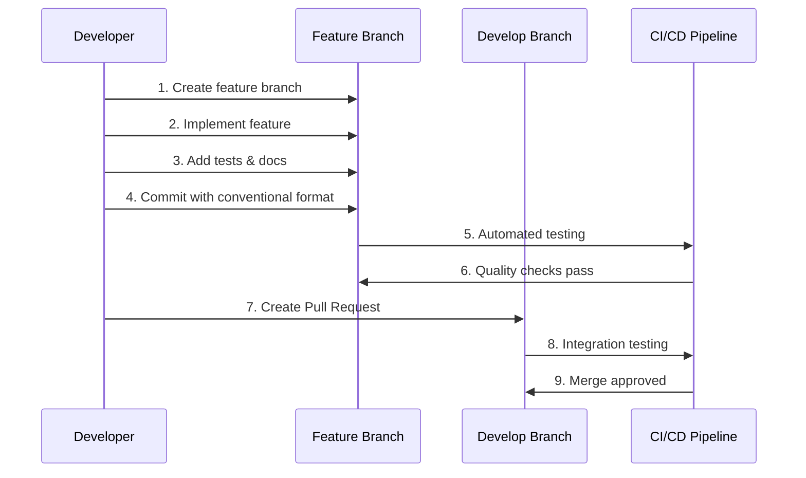
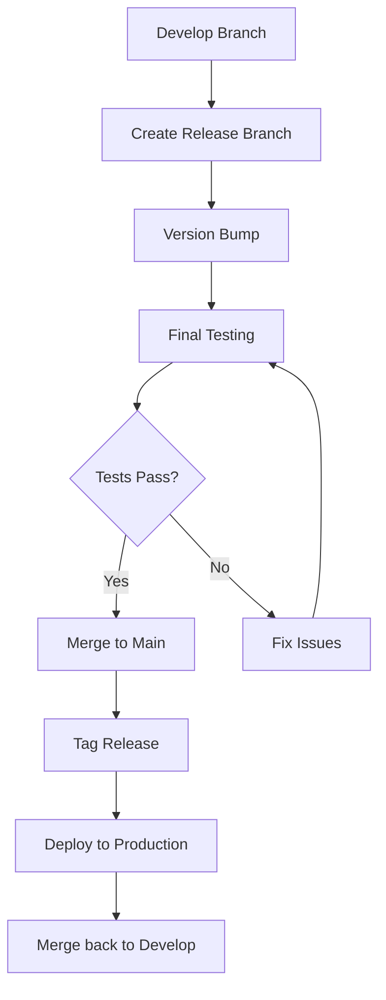
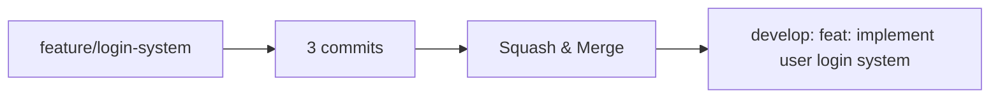
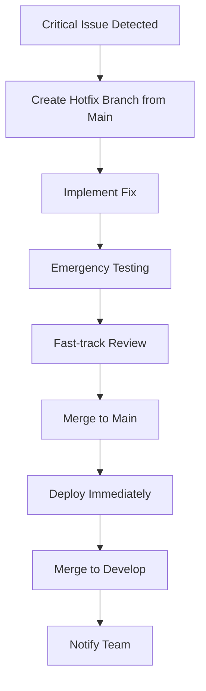
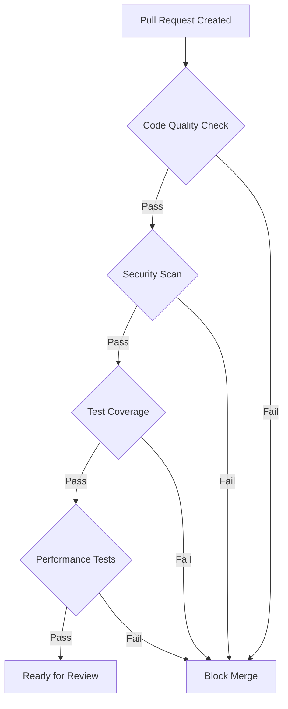

# Branch Strategy

OpenCoreMMO follows a **Git Flow** inspired branching strategy optimized for continuous integration and collaborative development.

## 🎯 Overview

Our branching strategy balances stability, feature development, and rapid iteration while maintaining code quality through automated validation.

```mermaid
gitgraph
    commit id: "Initial"
    branch develop
    checkout develop
    commit id: "Setup CI"
    
    branch feature/new-system
    checkout feature/new-system
    commit id: "Add feature A"
    commit id: "Add tests"
    commit id: "Update docs"
    
    checkout develop
    merge feature/new-system
    commit id: "Integrate feature"
    
    branch release/v1.1.0
    checkout release/v1.1.0
    commit id: "Bump version"
    commit id: "Final testing"
    
    checkout main
    merge release/v1.1.0
    commit id: "Release v1.1.0"
    
    checkout develop
    merge main
```

## 🌳 Branch Types

### Main Branches

| Branch | Purpose | Protection | Deployment |
|--------|---------|------------|------------|
| `main` | Production-ready code | 🛡️ **Protected** | 🚀 Auto-deploy to production |
| `develop` | Integration branch | 🛡️ **Protected** | 🧪 Auto-deploy to staging |

### Supporting Branches

| Type | Naming | Purpose | Lifetime |
|------|--------|---------|----------|
| **Feature** | `feature/feature-name` | New features and enhancements | Temporary |
| **Bugfix** | `bugfix/issue-description` | Bug fixes for develop | Temporary |
| **Hotfix** | `hotfix/critical-fix` | Critical production fixes | Temporary |
| **Release** | `release/v1.2.0` | Release preparation | Temporary |

## 🚀 Workflow Details

### Feature Development



### Release Process



## 📋 Branch Rules & Protections

### Main Branch Protection

- ✅ **Require pull request reviews** (minimum 2 approvals)
- ✅ **Require status checks** (all CI tests must pass)
- ✅ **Require up-to-date branches** (must be current with main)
- ✅ **Require signed commits** (commit signing enforced)
- ❌ **No direct pushes** (administrators included)

### Develop Branch Protection

- ✅ **Require pull request reviews** (minimum 1 approval)
- ✅ **Require status checks** (all CI tests must pass)
- ✅ **Require linear history** (no merge commits)
- ✅ **Automatically delete head branches** (cleanup after merge)

## 🛠️ Branch Operations

### Creating Feature Branches

```bash
# Start from develop
git checkout develop
git pull origin develop

# Create feature branch
git checkout -b feature/your-feature-name

# Push to remote
git push -u origin feature/your-feature-name
```

### Working with Features

```bash
# Regular commits during development
git add .
npm run commit  # Uses Commitizen for guided commits

# Push changes
git push origin feature/your-feature-name

# Keep branch updated with develop
git checkout develop
git pull origin develop
git checkout feature/your-feature-name
git rebase develop
```

### Creating Release Branches

```bash
# Create release branch from develop
git checkout develop
git pull origin develop
git checkout -b release/v1.2.0

# Update version and changelog
npm run release

# Push release branch
git push -u origin release/v1.2.0
```

## 🔄 Merge Strategies

### Feature → Develop

- **Strategy**: Squash and Merge
- **Rationale**: Clean history with single commit per feature
- **Requirements**: All commits follow conventional format



### Release → Main

- **Strategy**: Merge Commit
- **Rationale**: Preserve release history
- **Requirements**: Release branch fully tested

### Hotfix → Main

- **Strategy**: Fast-forward or Merge
- **Rationale**: Quick critical fixes
- **Requirements**: Immediate testing and approval

## 🏷️ Naming Conventions

### Feature Branches

```
feature/authentication-system
feature/player-inventory
feature/guild-management
bugfix/memory-leak-fix
bugfix/database-connection-timeout
```

### Release Branches

```
release/v1.0.0
release/v1.1.0-beta
release/v2.0.0-rc1
```

### Hotfix Branches

```
hotfix/security-vulnerability
hotfix/database-corruption
hotfix/memory-leak
```

## 🚨 Emergency Procedures

### Critical Hotfixes



### Rollback Procedures

```bash
# Quick rollback using Git
git checkout main
git revert <commit-hash>
git push origin main

# Or restore previous tag
git checkout main
git reset --hard <previous-tag>
git push --force-with-lease origin main
```

## 📊 Branch Metrics & Monitoring

### Automated Monitoring

- **Branch Lifetime**: Alerts for long-lived feature branches
- **Merge Frequency**: Track integration velocity
- **CI Success Rate**: Monitor build quality
- **Review Time**: Optimize review processes

### Quality Gates



## 🎓 Best Practices

### For Contributors

1. **Keep branches focused**: One feature per branch
2. **Regular updates**: Rebase with develop frequently
3. **Clean commits**: Use conventional commit format
4. **Test thoroughly**: Ensure all tests pass locally

### For Maintainers

1. **Quick reviews**: Aim for 24-hour review cycles
2. **Constructive feedback**: Help contributors improve
3. **Consistent standards**: Apply rules equally
4. **Documentation**: Keep branch rules updated

---

> 💡 **Remember**: This branching strategy supports our goal of rapid, reliable delivery while maintaining code quality. When in doubt, follow the automation and protections we've put in place!
