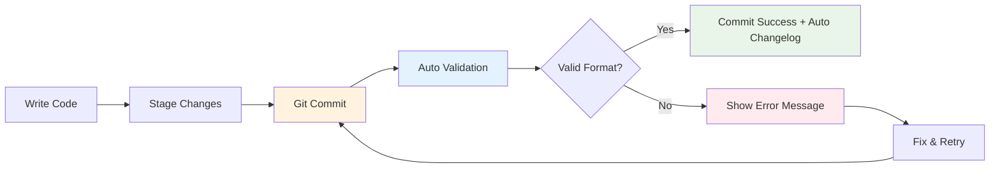
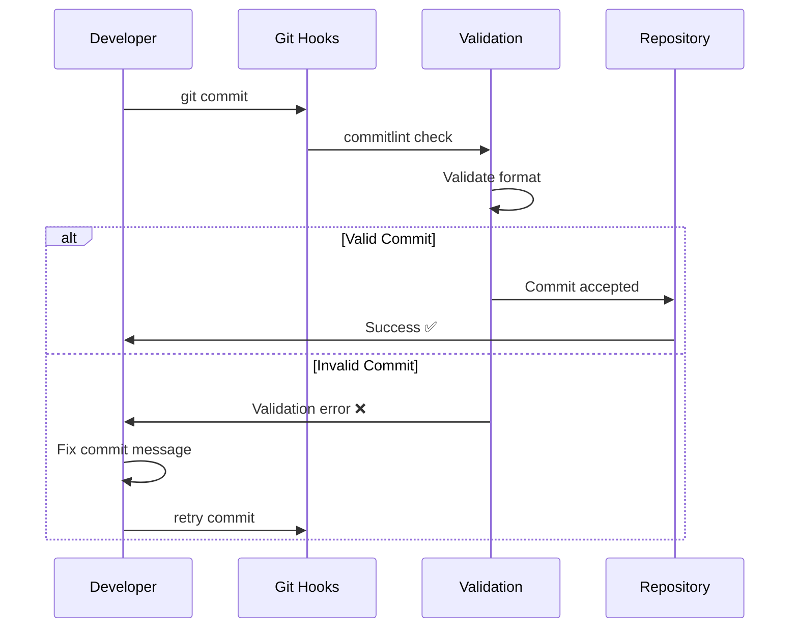
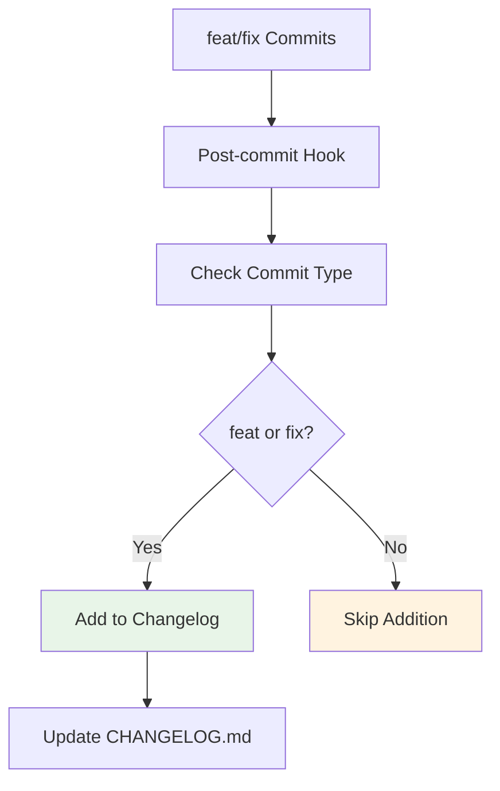
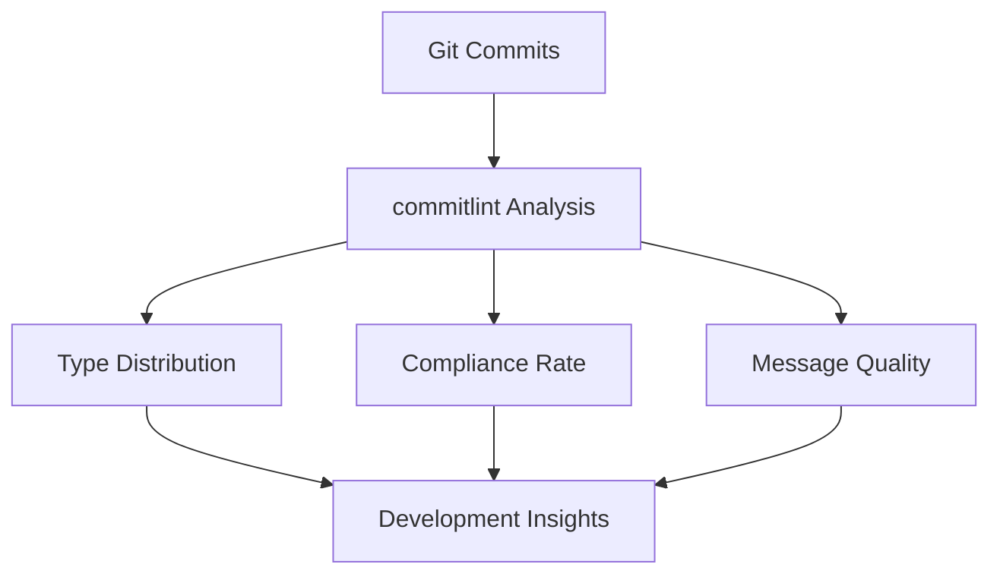

# Commit Guidelines

OpenCoreMMO enforces **Conventional Commits** specification to ensure consistent, meaningful commit history and enable automated changelog generation.

## 🎯 Overview

Our commit validation system automatically ensures every commit follows the conventional format, making our history semantic and enabling powerful automation.

**✨ 100% Automático**: Apenas faça `git commit` normalmente - nossa validação e changelog são automáticos!



## 📝 Commit Format

### Basic Structure

```
<type>[optional scope]: <description>

[optional body]

[optional footer(s)]
```

### Real Examples

```bash
feat: add user authentication system
fix(database): resolve connection timeout issues
docs: update API documentation for v2.0
refactor(core): optimize memory usage in game loop
test: add unit tests for player inventory
```

## 🏷️ Commit Types

| Type | Purpose | Changelog | Examples |
|------|---------|-----------|----------|
| `feat` | ✨ New features | ✅ **Auto-added** | `feat: add guild system` |
| `fix` | 🐛 Bug fixes | ✅ **Auto-added** | `fix: resolve memory leak` |
| `docs` | 📚 Documentation | ❌ *Not added* | `docs: update setup guide` |
| `style` | 💄 Code style | ❌ *Not added* | `style: format code with prettier` |
| `refactor` | ♻️ Code refactoring | ❌ *Not added* | `refactor: extract common utilities` |
| `perf` | ⚡ Performance | ❌ *Not added* | `perf: optimize database queries` |
| `test` | ✅ Testing | ❌ *Not added* | `test: add integration tests` |
| `build` | 🏗️ Build system | ❌ *Not added* | `build: update dependencies` |
| `ci` | 👷 CI/CD | ❌ *Not added* | `ci: add automated deployment` |
| `chore` | 🔧 Maintenance | ❌ *Not added* | `chore: update package versions` |
| `revert` | ⏪ Revert changes | ❌ *Not added* | `revert: undo previous commit` |

> 📝 **Changelog Policy**: Only `feat` and `fix` commits are automatically added to the changelog as they represent user-facing changes. Other types are still validated and encouraged for development tracking.

## 🎪 Interactive Commit Creation

We provide tools to make writing conventional commits easy and error-free.

### Using Commitizen (Recommended)

```bash
# Stage your changes
git add .

# Use interactive commit tool
npm run commit
```

This opens an interactive prompt:

```
? Select the type of change that you're committing: (Use arrow keys)
❯ feat:     A new feature
  fix:      A bug fix
  docs:     Documentation only changes
  style:    Changes that do not affect the meaning of the code
  refactor: A code change that neither fixes a bug nor adds a feature
  perf:     A code change that improves performance
  test:     Adding missing tests or correcting existing tests
```

### Manual Commits

You can still use regular git commands, but messages will be validated:

```bash
git commit -m "feat: implement player trading system"
```

## 🛡️ Validation Rules

Our automated validation enforces these rules:

### Header Rules

- **Type**: Must be one of the allowed types
- **Scope**: Optional, lowercase, no spaces
- **Description**: 
  - Required, not empty
  - Lowercase (no sentence case, title case, etc.)
  - No period at the end
  - **No size limits** - write as much as needed

### Body Rules

- **Leading blank line**: Required if body is present
- **Content**: Explain *what* and *why*, not *how*
- **No size limits** - write detailed explanations when needed

### Footer Rules

- **Leading blank line**: Required if footer is present
- **Format**: Key-value pairs or references
- **No size limits** - include all necessary information

## 🎨 Advanced Examples

### Feature with Scope

```
feat(auth): implement OAuth2 integration

Add support for OAuth2 authentication providers including
Google, GitHub, and Discord. This enables users to login
using their existing accounts from these services.

- Add OAuth2 client configuration
- Implement provider-specific handlers
- Add user account linking functionality

Closes #123, #456
```

### Breaking Change

```
feat!: upgrade to .NET 9.0

BREAKING CHANGE: Minimum required .NET version is now 9.0.
Previous installations using .NET 6.0 or 8.0 will need
to upgrade their runtime environment.

Migration guide available at: docs/migration/net9.md
```

### Multiple Issues

```
fix(inventory): resolve item duplication bug

Fix critical bug where items could be duplicated during
server lag spikes. Added transaction locks and validation
to prevent race conditions.

Fixes #789
Refs #790, #791
```

## 🔄 Commit Workflow

### Local Development



### Pre-commit Hooks

Our Husky hooks automatically run:

1. **Lint commit message**: Validates conventional format
2. **Run tests**: Ensures code quality
3. **Format code**: Applies consistent styling

## 📊 Changelog Generation

Our simplified changelog system automatically tracks user-facing changes:



### Generated Changelog Example

```markdown
## [2025-08-08]

- **feat: implement guild management system** ([abc123](https://github.com/opencoremmo/opencoremmo/commit/abc123))
- **fix: resolve inventory duplication bug** ([def456](https://github.com/opencoremmo/opencoremmo/commit/def456))

## [2025-08-07]

- **feat: add OAuth2 authentication** ([ghi789](https://github.com/opencoremmo/opencoremmo/commit/ghi789))
- **database**: fix connection timeout issues (#790)

### 📚 Documentation
- update API documentation for v2.0
- add deployment guide for production
```

## 🚨 Common Mistakes & Fixes

### ❌ Common Mistakes

```bash
# Wrong: Uppercase description
git commit -m "feat: Add new feature"

# Wrong: Period at end
git commit -m "feat: add new feature."

# Wrong: No type
git commit -m "add new feature"

# Wrong: Vague description
git commit -m "fix: fix bug"
```

### ✅ Correct Format

```bash
# Correct: Lowercase, descriptive, no period
git commit -m "feat: add user authentication system"

# Correct: With scope
git commit -m "fix(database): resolve connection timeout"

# Correct: Breaking change
git commit -m "feat!: upgrade to new API version"
```

## 🛠️ How to Commit

### Simple Git Commits

Use regular git commands - our system automatically validates:

```bash
# Just commit normally
git commit -m "feat: implement player trading system"

# ✅ Automatic validation ensures conventional format
# ✅ Changelog updated for feat/fix commits only
# ✅ No size limitations on commit messages
```

**That's it!** No interactive tools or complex setup needed.

## 📈 Metrics & Analytics

### Commit Quality Metrics

We track:
- **Commit format compliance**: 100% enforcement
- **Average commit message length**: Aim for descriptive but concise
- **Type distribution**: Balance of features, fixes, and maintenance
- **Breaking change frequency**: Monitor API stability

### Automated Reports



## 🎓 Best Practices

### Writing Great Commits

1. **Be specific**: Describe exactly what changed
2. **Use imperative mood**: "add feature" not "added feature"
3. **Focus on impact**: Explain the user-facing benefit
4. **Reference issues**: Link to relevant tickets
5. **Keep it atomic**: One logical change per commit

### Team Collaboration

1. **Consistent format**: Everyone uses the same tools
2. **Meaningful messages**: Help reviewers understand changes
3. **Linked documentation**: Reference relevant docs/issues
4. **Breaking changes**: Always document API changes

---

> 💡 **Pro Tip**: Just use `git commit` normally! Our automatic validation ensures perfect formatting every time, and there are no size restrictions - write as much detail as you need!
