# Release Process

OpenCoreMMO implements a streamlined, automated release process that ensures quality, reliability, and rapid delivery through CI/CD automation and comprehensive testing.

## 🎯 Overview

Our release process emphasizes automation, quality gates, and rapid feedback loops to deliver stable software with minimal manual intervention.

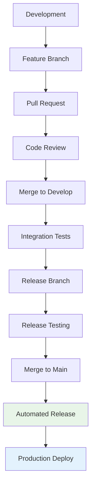

## 🚀 Release Types & Cadence

### Release Schedule

| Type | Frequency | Purpose | Scope |
|------|-----------|---------|-------|
| **Major** | Quarterly | Breaking changes, major features | 🏗️ **Architectural** |
| **Minor** | Monthly | New features, enhancements | ✨ **Feature** |
| **Patch** | As needed | Bug fixes, security updates | 🔧 **Maintenance** |
| **Hotfix** | Emergency | Critical production issues | 🚨 **Emergency** |

### Release Timeline

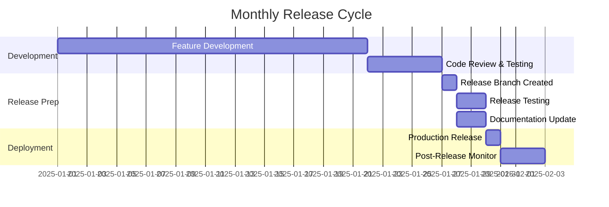

## 📋 Release Preparation

### Pre-Release Checklist

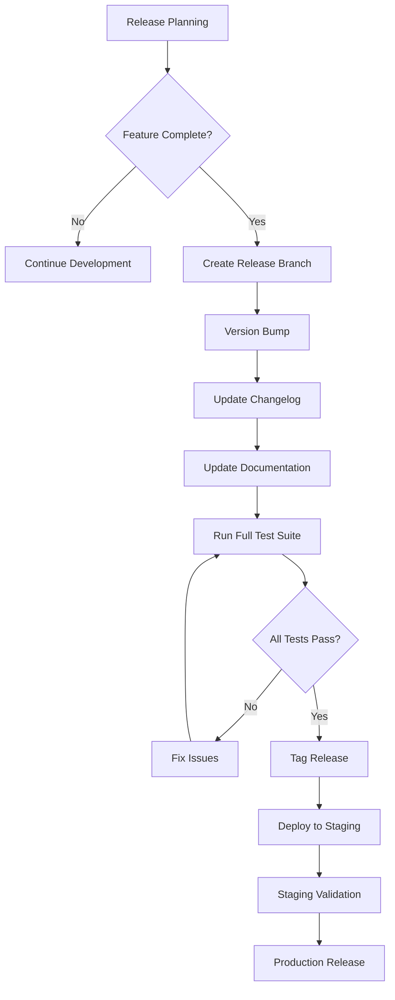

### Automated Release Commands

```bash
# Create release from develop branch
git checkout develop
git pull origin develop

# Generate release (automatically determines version)
npm run release

# Or create specific release types
npm run release -- --release-as major
npm run release -- --release-as minor
npm run release -- --release-as patch

# Preview release changes
npm run release:dry
```

## 🏗️ Release Branch Workflow

### Creating Release Branches

```bash
# Automated via npm script
npm run release

# Manual process
git checkout develop
git checkout -b release/v1.2.0
```

### Release Branch Rules

- **Source**: Always created from `develop` branch
- **Naming**: `release/v{version}` (e.g., `release/v1.2.0`)
- **Purpose**: Final testing and bug fixes only
- **Lifetime**: Temporary, deleted after merge
- **Protection**: Same as develop branch

## 🧪 Testing & Quality Gates

### Automated Testing Pipeline

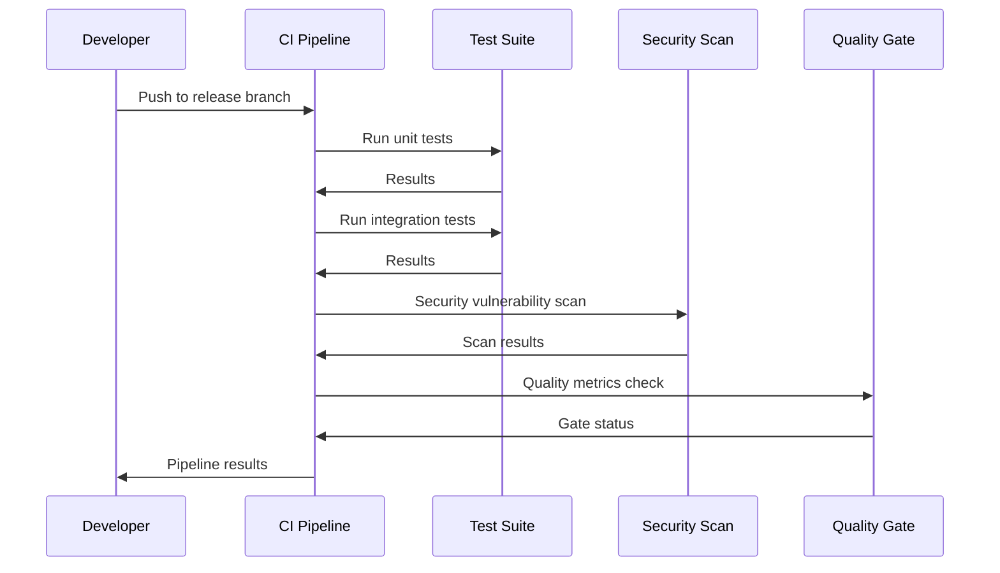

### Quality Gates

| Gate | Criteria | Blocking | Action on Failure |
|------|----------|----------|-------------------|
| **Unit Tests** | 100% pass rate | ✅ Yes | Fix failing tests |
| **Integration Tests** | 100% pass rate | ✅ Yes | Fix integration issues |
| **Code Coverage** | >80% coverage | ✅ Yes | Add missing tests |
| **Security Scan** | No high/critical vulns | ✅ Yes | Address vulnerabilities |
| **Performance** | No regression >10% | ⚠️ Warning | Investigate performance |
| **Documentation** | All endpoints documented | ⚠️ Warning | Update documentation |

## 📦 Release Artifacts

### Generated Artifacts

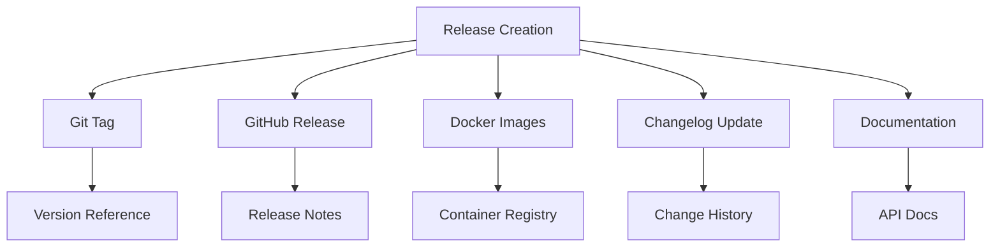

### Artifact Details

| Artifact | Location | Purpose |
|----------|----------|---------|
| **Git Tag** | Repository | Version reference point |
| **Release Notes** | GitHub Releases | User-facing changes |
| **Docker Images** | Container Registry | Deployment artifacts |
| **Changelog** | CHANGELOG.md | Detailed change history |
| **API Documentation** | docs/api/ | Technical reference |

## 🚀 Deployment Process

### Staging Deployment

```bash
# Automated staging deployment
git push origin release/v1.2.0
# Triggers CI/CD pipeline to staging environment
```

### Production Deployment

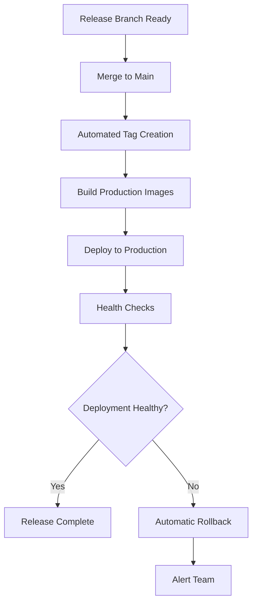

### Deployment Commands

```bash
# Manual production deployment
git checkout main
git merge release/v1.2.0
git push origin main
# Automated pipeline deploys to production

# Emergency rollback
git checkout main
git revert HEAD
git push origin main
```

## 📊 Release Validation

### Health Checks

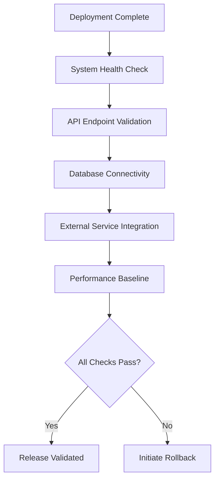

### Monitoring & Alerts

Post-deployment monitoring includes:

- **Application Health**: Response times, error rates
- **Infrastructure**: CPU, memory, disk usage
- **Business Metrics**: User activity, feature adoption
- **Security**: Unusual access patterns, vulnerabilities

## 🔄 Post-Release Process

### Release Retrospective

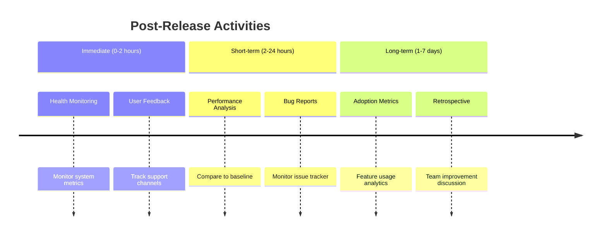

### Cleanup Tasks

```bash
# Delete release branch
git branch -d release/v1.2.0
git push origin --delete release/v1.2.0

# Merge back to develop
git checkout develop
git merge main
git push origin develop

# Update project board
# Move completed issues to "Done"
```

## 🚨 Emergency Release Process

### Hotfix Workflow

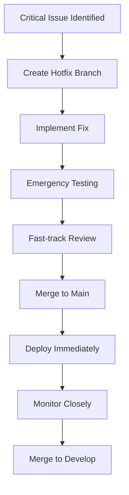

### Hotfix Commands

```bash
# Create hotfix from main
git checkout main
git checkout -b hotfix/critical-security-fix

# Implement and test fix
# ... make changes ...
git add .
git commit -m "fix: resolve critical security vulnerability"

# Fast-track release
npm run release
git checkout main
git merge hotfix/critical-security-fix
git push origin main
```

## 📈 Release Metrics

### Key Performance Indicators

| Metric | Target | Measurement |
|--------|--------|-------------|
| **Lead Time** | <2 weeks | Feature to production |
| **Deployment Frequency** | Monthly | Regular releases |
| **Mean Time to Recovery** | <1 hour | Incident resolution |
| **Change Failure Rate** | <5% | Failed deployments |

### Release Dashboard

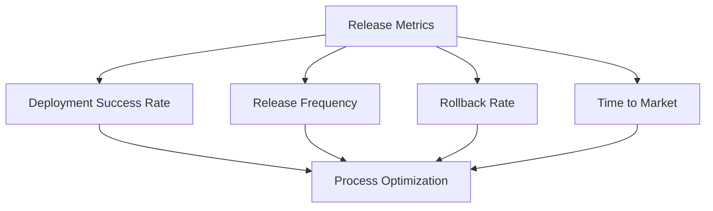

## 🛠️ Tools & Automation

### Automated Commit System

Our release process is powered by automatic commit validation and changelog generation:

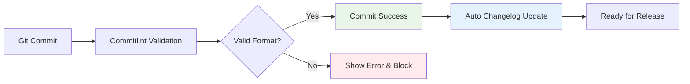

**✨ Key Features:**
- **Zero Configuration**: Just use `git commit` normally
- **Automatic Validation**: Ensures conventional commit format
- **No Size Limits**: Write detailed commit messages
- **Auto Changelog**: Updates automatically on valid commits
- **Release Ready**: `npm run release` generates versions and tags

### Release Toolchain

| Tool | Purpose | Configuration |
|------|---------|---------------|
| **commitlint** | Commit message validation | `commitlint.config.js` |
| **standard-version** | Version bumping, changelog | `.versionrc.json` |
| **Husky** | Git hooks validation | `.husky/` |
| **GitHub Actions** | CI/CD pipeline | `.github/workflows/` |
| **Docker** | Containerization | `Dockerfile` |
| **Terraform** | Infrastructure | `infrastructure/` |

### Configuration Files

```
server/
├── .versionrc.json          # standard-version config
├── commitlint.config.js     # Commit validation
├── .github/
│   └── workflows/
│       ├── release.yml      # Release pipeline
│       └── deploy.yml       # Deployment pipeline
└── scripts/
    ├── release.sh           # Release automation
    └── deploy.sh            # Deployment scripts
```

## 🎓 Best Practices

### For Release Managers

1. **Automate Everything**: Minimize manual steps
2. **Test Thoroughly**: Never skip quality gates
3. **Communicate Clearly**: Keep stakeholders informed
4. **Monitor Actively**: Watch post-deployment metrics
5. **Learn Continuously**: Improve process based on feedback

### For Developers

1. **Follow Conventions**: Use conventional commits
2. **Test Locally**: Ensure tests pass before pushing
3. **Document Changes**: Update relevant documentation
4. **Monitor Deployments**: Watch your features in production

---

> 🎯 **Success Criteria**: Reliable, predictable releases that deliver value to users while maintaining system stability and team confidence.
