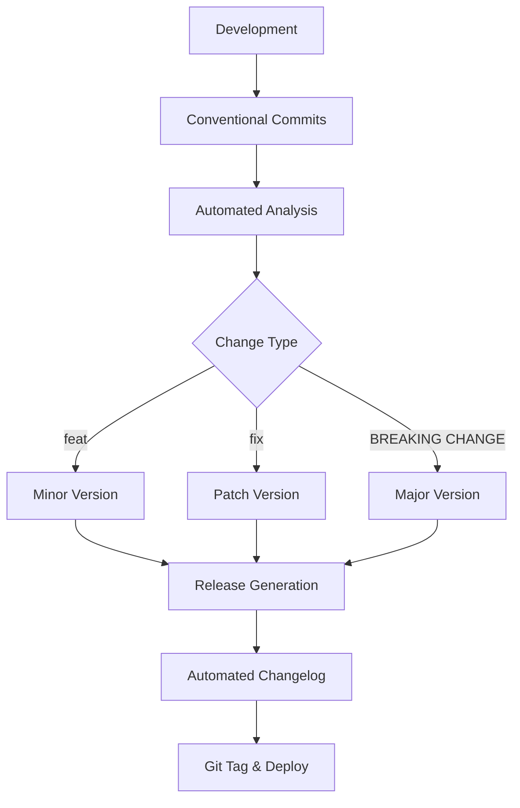
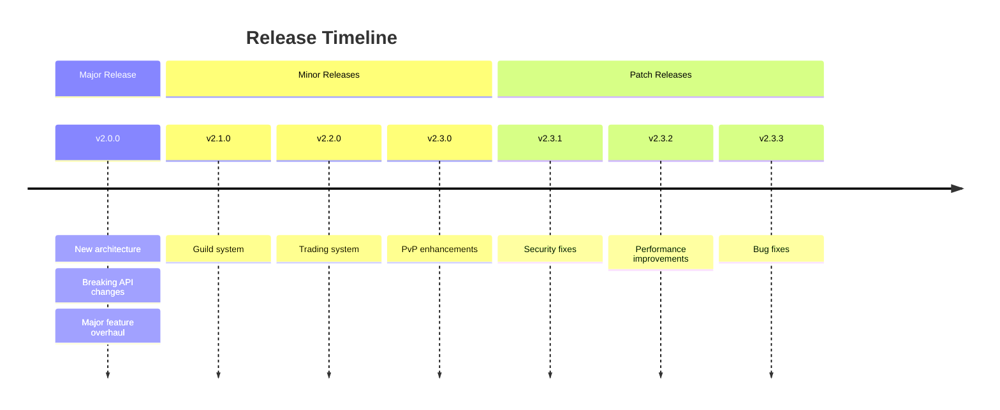
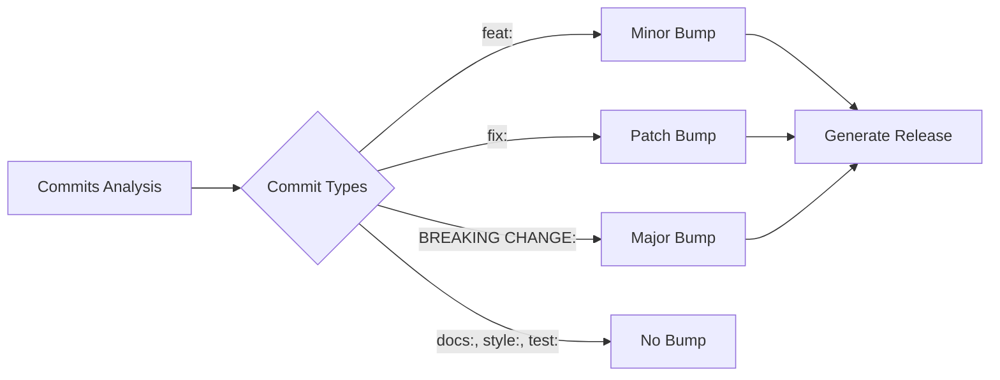
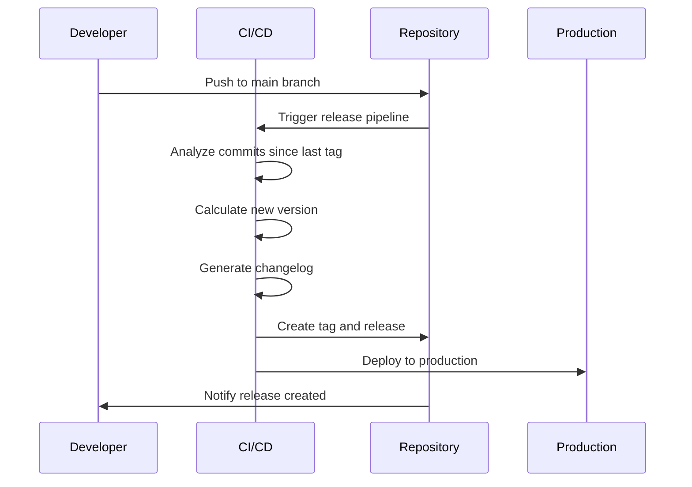
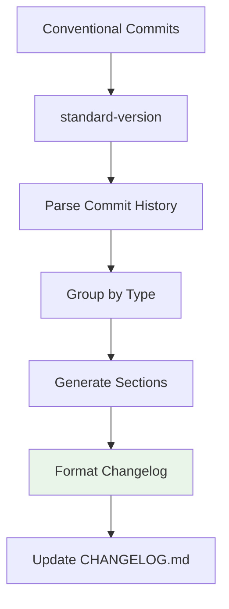
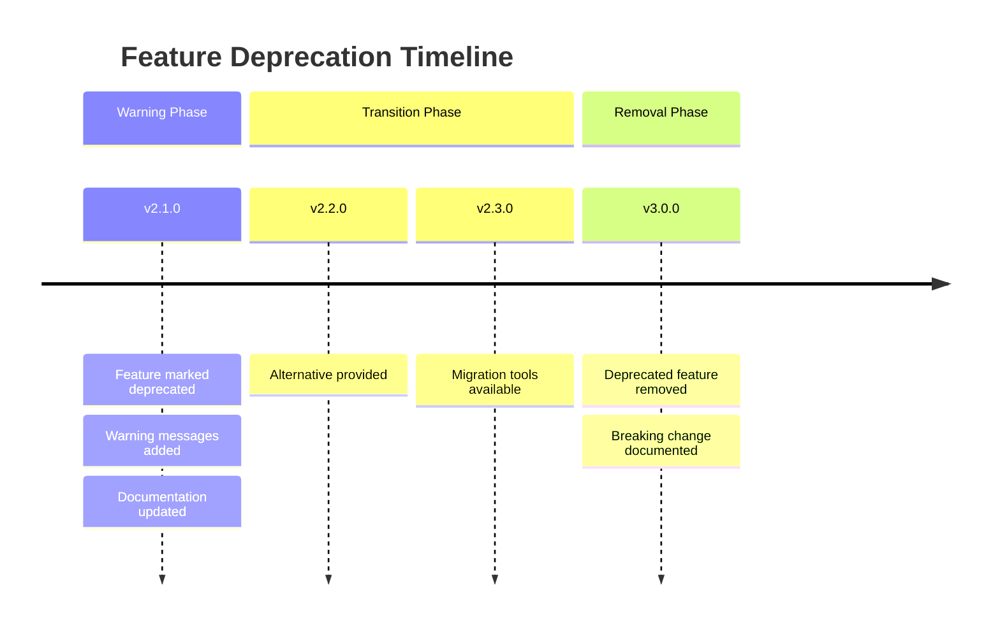
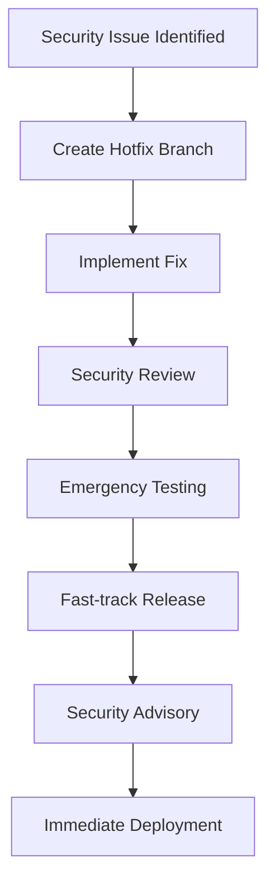
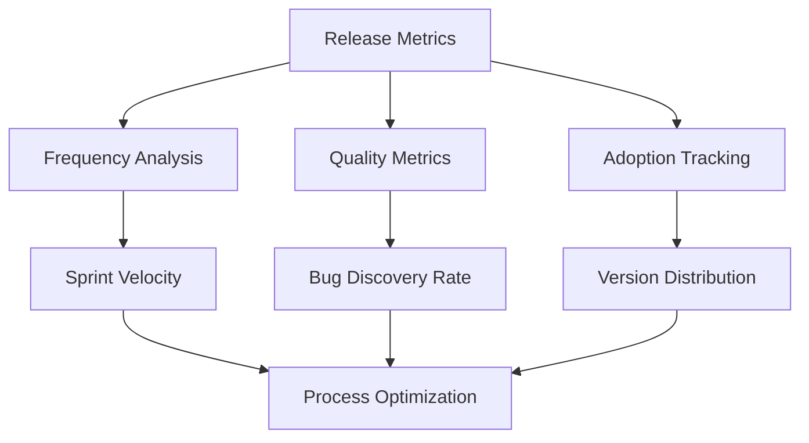
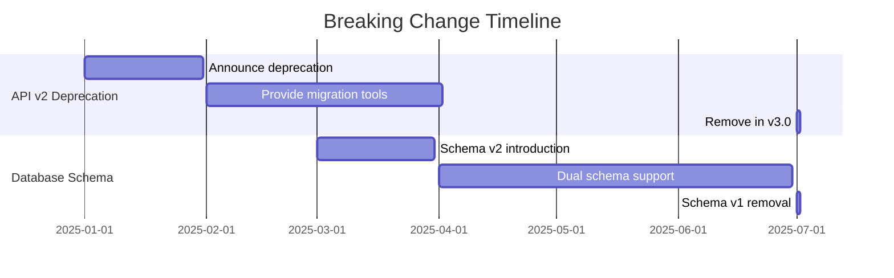
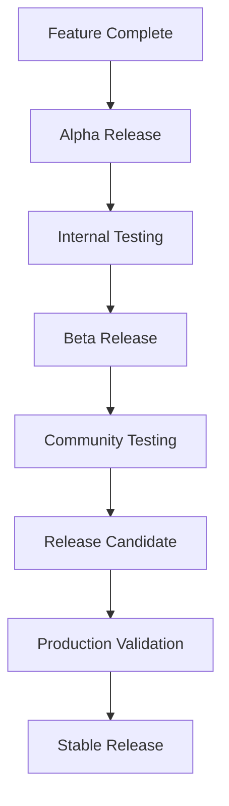

# Versioning Strategy

OpenCoreMMO follows **Semantic Versioning (SemVer)** principles with automated release management to ensure predictable, reliable software delivery.

## 🎯 Overview

Our versioning strategy balances predictability for users with flexibility for rapid development, using automation to maintain consistency and reduce manual overhead.



## 📊 Semantic Versioning Structure

### Version Format: `MAJOR.MINOR.PATCH`

```
v2.1.3
│ │ │
│ │ └─ PATCH: Bug fixes, security patches
│ └─── MINOR: New features, backward compatible
└───── MAJOR: Breaking changes, API changes
```

### Version Components

| Component | When to Increment | Examples | Impact |
|-----------|------------------|----------|---------|
| **MAJOR** | Breaking changes | API changes, removed features | ⚠️ **Breaking** |
| **MINOR** | New features | New endpoints, enhanced functionality | ✅ **Compatible** |
| **PATCH** | Bug fixes | Security fixes, performance improvements | 🔧 **Safe** |

## 🚀 Release Types

### Stable Releases



### Pre-release Versions

| Type | Format | Purpose | Stability |
|------|--------|---------|-----------|
| **Alpha** | `v2.1.0-alpha.1` | Early development, internal testing | 🔴 **Unstable** |
| **Beta** | `v2.1.0-beta.1` | Feature complete, community testing | 🟡 **Testing** |
| **RC** | `v2.1.0-rc.1` | Release candidate, final validation | 🟢 **Stable** |

## 🤖 Automated Version Bumping

### Commit-Based Analysis

Our automation analyzes conventional commits to determine version increments:



### Version Calculation Rules

```javascript
// Simplified version bump logic
function calculateVersion(commits, currentVersion) {
  let hasMajor = commits.some(c => c.breaking);
  let hasMinor = commits.some(c => c.type === 'feat');
  let hasPatch = commits.some(c => c.type === 'fix');
  
  if (hasMajor) return bumpMajor(currentVersion);
  if (hasMinor) return bumpMinor(currentVersion);
  if (hasPatch) return bumpPatch(currentVersion);
  
  return currentVersion; // No release needed
}
```

## 📋 Release Process

### Automated Release Workflow



### Manual Release Commands

```bash
# Generate standard release
npm run release

# Generate first release (no version bump)
npm run release:first

# Dry run (preview changes)
npm run release:dry

# Pre-release versions
npm run release -- --prerelease alpha
npm run release -- --prerelease beta
npm run release -- --prerelease rc
```

## 🏷️ Tagging Strategy

### Tag Naming Convention

```
v1.0.0          # Stable release
v1.1.0-alpha.1  # Alpha pre-release
v1.1.0-beta.2   # Beta pre-release
v1.1.0-rc.1     # Release candidate
```

### Tag Metadata

```bash
# Lightweight tag (automated)
git tag v1.2.0

# Annotated tag with metadata
git tag -a v1.2.0 -m "Release v1.2.0: Guild System Implementation

Features:
- Complete guild management system
- Guild wars and alliances
- Enhanced player progression

Bug Fixes:
- Resolved memory leak in combat system
- Fixed database connection issues

BREAKING CHANGES:
- Player API endpoint structure updated
"
```

## 📈 Version History & Tracking

### Release Artifacts

Each release generates:

1. **Git Tag**: Permanent reference point
2. **GitHub Release**: Release notes and assets
3. **Changelog Entry**: Detailed change documentation
4. **Docker Images**: Tagged container images
5. **Documentation**: Version-specific docs

### Change Documentation



## 🔄 Backward Compatibility

### Compatibility Matrix

| Change Type | Version Impact | Backward Compatible | Migration Required |
|-------------|----------------|--------------------|--------------------|
| **Bug Fix** | PATCH | ✅ Yes | ❌ No |
| **New Feature** | MINOR | ✅ Yes | ❌ No |
| **Deprecation** | MINOR | ⚠️ Warning | 🟡 Eventually |
| **Breaking Change** | MAJOR | ❌ No | ✅ Yes |

### Deprecation Policy



## 🚨 Emergency Releases

### Hotfix Versioning

```bash
# Emergency patch release
git checkout main
git checkout -b hotfix/security-fix
# ... make critical fixes ...
git checkout main
git merge hotfix/security-fix
npm run release  # Auto-increments patch version
```

### Security Release Process



## 📊 Release Analytics

### Metrics Tracking

We monitor:
- **Release Frequency**: Target monthly minor releases
- **Time to Release**: From commit to production
- **Rollback Rate**: Percentage of releases requiring rollback
- **Breaking Change Impact**: User adoption of major versions

### Release Health Dashboard



## 🎯 Version Planning

### Release Roadmap

| Quarter | Target Version | Major Features |
|---------|----------------|----------------|
| **Q1 2025** | v2.1.0 | Guild System, Enhanced PvP |
| **Q2 2025** | v2.2.0 | Trading System, Market Economy |
| **Q3 2025** | v2.3.0 | World Events, Dynamic Content |
| **Q4 2025** | v3.0.0 | Architecture Modernization |

### Breaking Change Planning



## 🛠️ Development Guidelines

### Version-Aware Development

1. **Feature Flags**: Use flags for major features
2. **Gradual Rollout**: Implement features incrementally
3. **Backward Compatibility**: Maintain API compatibility within major versions
4. **Documentation**: Update docs with version-specific information

### Pre-release Testing



---

> 🎯 **Goal**: Predictable, reliable releases that balance rapid innovation with stability and user confidence in our versioning system.
